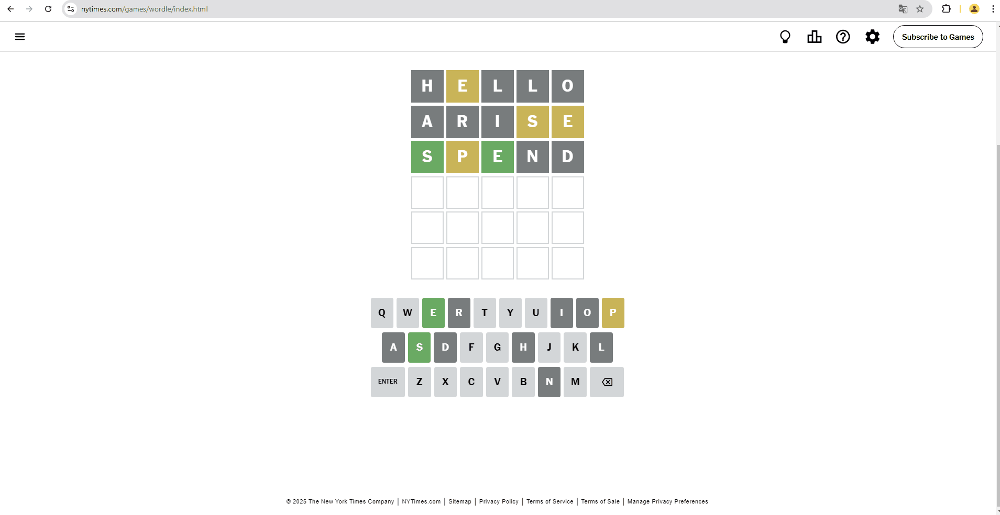

# Wordle Solver Chrome Extension

A smart Chrome extension that helps you solve the daily NYT Wordle puzzle by analyzing your current game state and suggesting optimal next guesses.

## Features

- 🎯 One-click parsing of your current Wordle game state
- 🎨 Displays your current game progress with matching Wordle colors
- 🤖 Provides intelligent word suggestions based on your current game state
- 🔒 Privacy-focused: No personal data collection or storage

## Installation

1. Download the extension from the Chrome Web Store (link coming soon)
2. Click the "Add to Chrome" button
3. The Wordle Solver icon will appear in your Chrome toolbar

## How to Use

1. Navigate to [NYT Wordle](https://www.nytimes.com/games/wordle/index.html)
2. Start your Wordle game
3. Click the Wordle Solver extension icon in your toolbar
4. Click "Parse and Get Hint" to:
   - View your current game state
   - Get a suggestion for your next guess
5. If you haven't made any guesses yet, the extension will suggest a strong starter word

## Privacy

- Only game-related data is collected (letters and their colors)
- No personal information is stored
- All data processing is done through secure HTTPS connections
- For more details, see our [Privacy Policy](https://gaohey.github.io/wordler-helper-privacy/privacy-policy.html)

## Technical Details

- Built with vanilla JavaScript
- Uses Chrome Extension Manifest V3
- Communicates with a Python-based hint generation API
- Source code available at [GitHub](https://github.com/gaohey/wordler)

## Support

Having issues or questions? Contact us at:
- Email: yian.he0918@gmail.com

## License

This project is licensed under the MIT License - see the LICENSE file for details.

---
Made by Yian He
